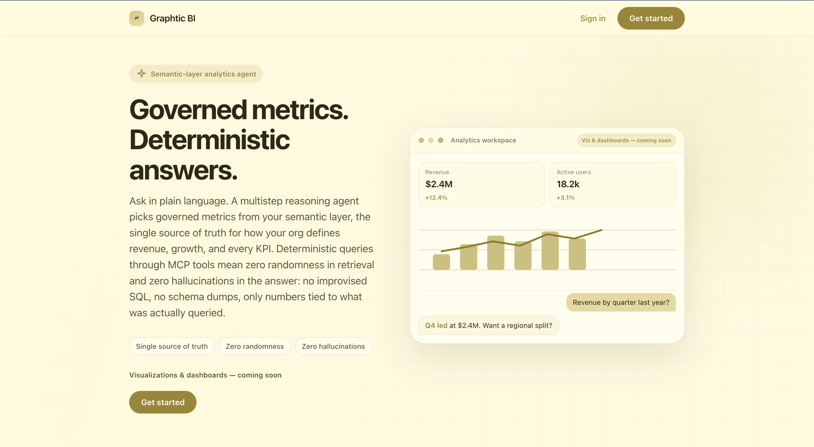

# Graphtic BI

**Governed metrics. Deterministic answers.**

Graphtic BI is a conversational analytics product built on your semantic metric layer. Ask questions in plain language; a multistep reasoning agent selects governed metrics, runs them through MCP tools, and returns answers tied to real query results—not improvised SQL or warehouse schema dumped into the model.

| Capability | What you get |
|------------|----------------|
| **Single source of truth** | One semantic layer for chat (and soon dashboards) |
| **Deterministic retrieval** | Metric-layer queries via tools, not model guesswork |
| **Lean context** | Governed catalog instead of full DDL in every turn |
| **Transparent answers** | Tool trace on each response so you see what ran |

**Available today:** governed conversational analytics with full audit trail.

**Coming soon:** interactive **visualizations** and **dashboards** on the same metrics.

---

## Product overview

**Metric catalog, not schema sprawl** — The agent reasons over approved definitions, not hundreds of table columns in the prompt.

**Multistep planning** — Each question is decomposed into steps; the agent picks metrics and executes MCP tools before answering.

**Zero randomness in retrieval** — Numbers come from metric-layer execution. You see which tools ran and what returned.

**Zero hallucinations in figures** — Answers map only to query results from governed definitions.

---

## Screenshots



---

## Architecture

```
 Browser  ──▶  API  ──▶  LangGraph (ReAct agent)  ──▶  MCP  ──▶  MetricFlow / semantic layer
    │              │                                        ▲
    └──────── SSE streaming (answers + tool events) ────────┘
```

| Layer | Role |
|-------|------|
| **Web app** | Landing, sign-in, chat UI with markdown answers and expandable tool traces |
| **API** | FastAPI; streams agent events to the browser |
| **Agent** | ReAct-style planner over semantic-layer tools |
| **MCP** | Tool bridge to list metrics, dimensions, and run governed queries |
| **Semantic layer** | dbt + MetricFlow as the system of record for definitions and data |

Responses stream over **Server-Sent Events (SSE)** so answers and tool steps appear incrementally.

---

## Technical requirements

| Requirement | Notes |
|-------------|--------|
| **Semantic layer** | dbt project with MetricFlow configured |
| **LLM** | Anthropic (default); other providers configurable in the API layer |
| **Identity** | Supabase email auth (sign-in, password reset) |
| **Runtime** | Docker (recommended) or Python 3.12+ with Poetry for local API |

### Environment

Configure via `.env` before starting the stack:

| Variable | Purpose |
|----------|---------|
| `LLM_PROVIDER`, `LLM_MODEL`, `ANTHROPIC_API_KEY` | Model for the agent |
| `DBT_PROJECT_DIR`, `DBT_PROFILES_DIR`, `MF_BIN` | MetricFlow / dbt paths |
| `MCP_PYTHON_BIN`, `MCP_SERVER_PATH` | MCP subprocess for tool execution |
| `SUPABASE_URL`, `VITE_SUPABASE_URL`, `VITE_SUPABASE_PUBLISHABLE_KEY` | Authentication |

Optional: `LANGSMITH_TRACING`, `LANGSMITH_API_KEY`, `CORS_ORIGINS`, `LOG_LEVEL`. Set `AUTH_DISABLED=true` only for temporary local testing.

Supabase **Site URL** and **Redirect URLs** must include your app origin (e.g. `http://localhost:8080/**`).

---

## Deployment

Start the full stack (API + web) with Docker:

```bash
docker compose up --build -d
```

Open **http://localhost:8080**, sign in, and start asking questions about your metrics.

Health check: `GET /healthz` on the API port (default **8000** behind the proxy).
